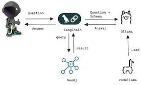
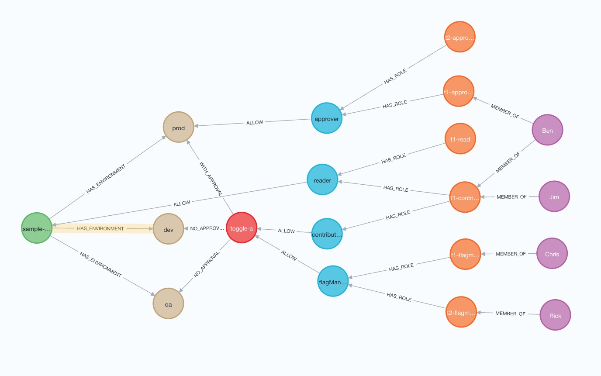

# LaunchDarkly Custom Roles and Permissions Query Tool

This Python application demonstrates how to use the Ollama language model and the Neo4j graph database to query and retrieve information about LaunchDarkly custom roles and permissions.


## Features

- Connects to a Neo4j database using the provided credentials
- Loads a sample dataset into the Neo4j database
- Defines a custom Cypher query template for translating user questions into Cypher queries
- Utilizes the Ollama language model to generate Cypher queries based on user questions
- Executes the generated Cypher queries against the Neo4j database
- Retrieves and displays the query results

## Prerequisites

- Python 3.x
- Neo4j database
- Ollama language model API access
- LangChain

## Installation

1. Clone the repository:

```bash
git clone git@github.com:tanben/genai-projects.git
cd neo4j-rad-proj
```

2. Install the required Python packages:

```bash
pip install -r requirements.txt
```

3. Create a `.env` file in the project directory and provide the following configuration:

```
NEO4J_URI=<your-neo4j-uri>
NEO4J_USER=<your-neo4j-username>
NEO4J_PASS=<your-neo4j-password>
NEO4J_TIMEOUT=<neo4j-timeout>
LLM_MODEL=<llama-model>
LLM_BASE_URL=<llama-api-base-url>
```

## Usage

1. Run the application:

```bash
python app.py
```

2. The application will load the sample dataset into the Neo4j database and execute a set of predefined questions.

3. The generated Cypher queries and the corresponding query results will be displayed in the console.

## Customization

- To modify the sample dataset, update the `instance_model` variable in the `app.py` file.
- To add or modify the predefined questions, update the `questions` list in the `app.py` file.
- To customize the Cypher query template, modify the `cypher_template` variable in the `app.py` file.


## Sample Dataset



#### Sample query
Query: List users, team assignments and permissions in a table sorted by member.

Answer:

| User | Team Assignment | Permissions |
| --- | --- | --- |
| Ben | t1-contributor | viewProject |
| Ben | t1-contributor | updateRules, updateTargets |
| Ben | t1-approver | reviewApprovalRequest, applyApprovalRequest |
| Chris | t1-flagmanager | createFlag, updateFlagVariations |
| Jim | t1-contributor | viewProject |
| Jim | t1-contributor | updateRules, updateTargets |
| Rick | t2-flagmanager | createFlag, updateFlagVariations |


Generated Cypher:
```
MATCH (u:User)-[:MEMBER_OF]->(t:Team)-[:HAS_ROLE]->(r:Role)-[a:ALLOW]->(f)
RETURN u.name, t.name, r.name, a.permissions
ORDER BY u.name

```

## Acknowledgements
- [LangChain](https://www.langchain.com/) - Framework for developing LLM apps
- [Ollama](https://www.ollama.com/) - Language model API
- [Neo4j](https://neo4j.com/) - Graph database
- [LaunchDarkly](https://launchdarkly.com/) - Feature flag management platform

